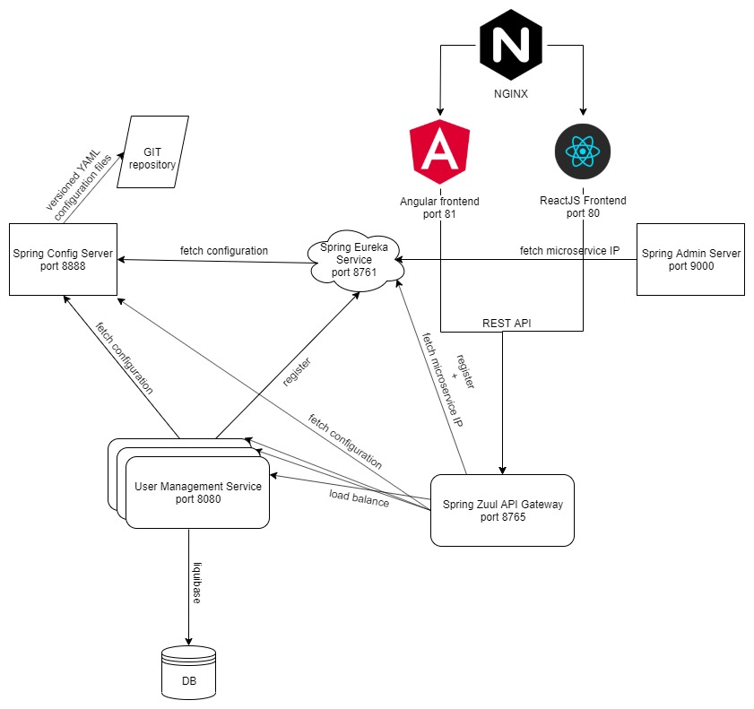

# Docker, Microservices, Spring Cloud, Spring Boot, React, Angular, H2, Hibernate, Liquibase



The application structure is as follows.
- **admin-server** - Microservice implemented using Spring Admin Server. [More info](admin-server/README.md)
- **config-server** - Microservice implemented using Spring Config Server. [More info](config-server/README.md)
- **eureka-discovery-service** - Microservice implemented using Spring Eureka. [More info](eureka-discovery-service/README.md)
- **zuul-gateway-service** - Microservice implemented using Spring Zuul. [More info](zuul-gateway-service/README.md)
- **user-management-service** - Microservice implemented using Spring boot. [More info](user-management-service/README.md)
- **react-client** - A NodeJs application implemented using React. This consumes services hosted by server side. [More info](react-client/README.md)
- **angular-client** - A NodeJs application implemented using Angular. This consumes services hosted by server side. [More info](angular-client/README.md)

### Build

#### 1) Build Spring Boot microservices
   
```
$ cd microservices path
$ mvnw clean install
$ mvnw spring-boot:run
```

#### 2) Build and run client side application

React
```
$ cd react-client
$ yarn install
$ yarn start
```

Angular
```
$ cd angular-client
$ npm install
$ ng serve
```


### Access application using following URL

React
```
http://localhost:3000
```

Angular
```
http://localhost:4200
```

### Performance / Load tests

Test structure is as follows.
- **perf-test** - A Apache JMeter test plan designed to load test functional behavior and measure performance. [More info](perf-test/README.md)

### Docker

#### 1) Build all modules and docker images

```
mvnw clean deploy -P docker
```

#### 2) Run docker

```
docker-compose up -d
```
